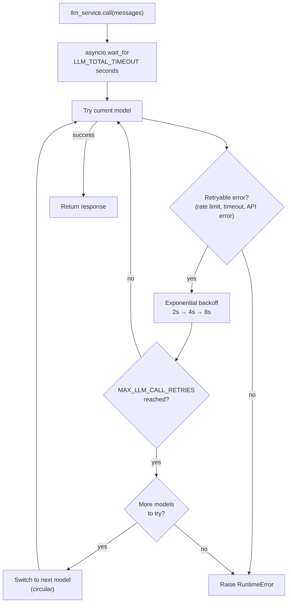

# LLM Service

## Overview

The LLM service (`app/services/llm/`) handles all language model calls with automatic retries, circular model fallback, and a total timeout budget. Your agent code calls `llm_service.call(messages)` — the service handles everything else.

The package is split into two modules:

- `app/services/llm/registry.py` — `LLMRegistry`: defines available models
- `app/services/llm/service.py` — `LLMService`: call logic, retries, fallback, structured output

## Model registry

Models are defined in `LLMRegistry.LLM_CONFIGS` in order of preference:

| Name           | Model        | Notes                              |
| -------------- | ------------ | ----------------------------------- |
| `gpt-5.6-luna` | gpt-5.6-luna | Default. Medium reasoning effort.  |
| `gpt-5.4`      | gpt-5.4      | Medium reasoning effort.           |
| `gpt-5.4-mini` | gpt-5.4-mini | Low reasoning effort.              |
| `gpt-5.4-nano` | gpt-5.4-nano | Fast, low reasoning effort.        |

Set `DEFAULT_LLM_MODEL` in your `.env` to choose the starting model.

Every entry is built through LangChain's `init_chat_model`. A bare `model` name (like the ones above) is inferred as OpenAI, so existing entries and env vars keep working unchanged. To add a model from another provider, prefix `model` with `provider:`, e.g.:

```python
{"name": "claude-opus", "model": "anthropic:claude-opus-4-6", "kwargs": {"temperature": 0.2}},
```

That provider's LangChain integration package must be installed (`uv sync --extra anthropic`, `--extra ollama`, or `--extra google-genai`) and its API key set via the provider's own env var (e.g. `ANTHROPIC_API_KEY`) — the registry does not manage non-OpenAI credentials itself.

To add or change models, edit `LLMRegistry.LLM_CONFIGS` in `app/services/llm/registry.py`.

## Retry and fallback behaviour



**Retry config** (per model):

- Max attempts: `MAX_LLM_CALL_RETRIES` (default: 3)
- Wait: exponential backoff, 2s min, 10s max
- Retries on: `openai`'s `RateLimitError`, `APITimeoutError`, `APIError`

  These are OpenAI-specific exception types. A non-OpenAI registry entry (e.g. `anthropic:claude-opus-4-6`) still gets circular fallback to the next model on any exception, but not the per-model exponential-backoff retry until that provider's error types are added to this tuple too.

**Total timeout**: `LLM_TOTAL_TIMEOUT` seconds (default: 60s) caps the entire loop. Without this, worst case is `retries × models × max_wait` — potentially 2+ minutes.

**Fallback order**: circular through `LLMRegistry.LLMS`. After the last model, wraps back to the first and stops after one full cycle.

## Tools

Tools are bound to the LLM at startup:

```python
llm_service.bind_tools(tools)
```

When a model is switched during fallback, the tools are re-bound to the new model automatically.

## Structured output

Pass a Pydantic model as `response_format` to get a validated instance back instead of a raw `BaseMessage`:

```python
from app.schemas.my_schema import MySchema

result: MySchema = await llm_service.call(
    messages,
    model_name="gpt-5.4-nano",   # optional — uses current default if omitted
    response_format=MySchema,
    temperature=0.2,
)
```

The service chains `.with_structured_output(schema)` on the resolved model and re-wraps it on every fallback attempt, so retries and model switching work transparently.

## Adding a new model

```python
# app/services/llm/registry.py — LLMRegistry.LLM_CONFIGS
{
    "name": "gpt-5.4",
    "model": "gpt-5.4",  # or "provider:model", e.g. "anthropic:claude-opus-4-6"
    "kwargs": {
        "max_completion_tokens": settings.MAX_TOKENS,
        "reasoning": {"effort": "medium"},  # OpenAI-only; drop for other providers
    },
},
```

Add it at any position in the list. The fallback order follows the list order.
